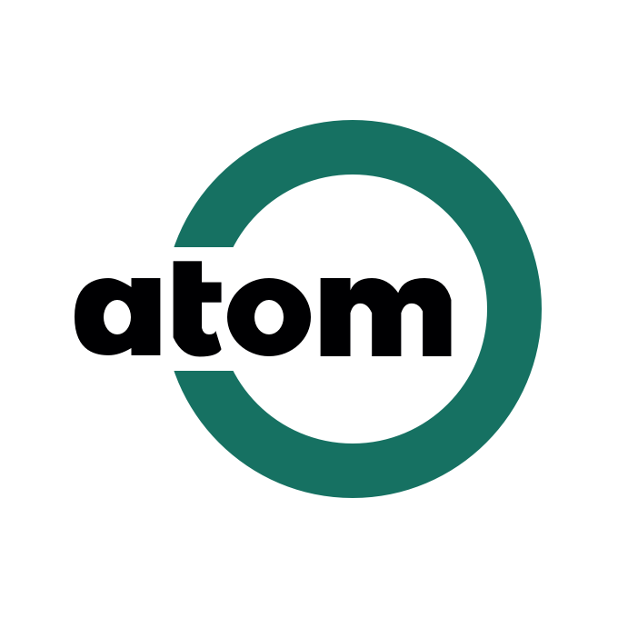

# AtomTools

## 极速、强大、开箱即用的 TypeScript 工具库

⚡️ **AtomTools** 是一个基于 TypeScript 的 JavaScript 工具库，内含丰富的实用工具函数。只需简单导入，即可在您的项目中快速使用。

### 为什么选择 AtomTools

在业务项目开发中，开发者经常面临编写重复且复杂的函数、类型和常量的挑战。这些代码往往需要在不同项目间移植和重用。

**AtomTools** 的使命是为开发人员提供一个简便快捷的解决方案，以便更高效地管理和使用常用的函数、类型和常量。通过 AtomTools，您将能够摆脱繁琐的任务，专注于核心业务逻辑的开发。

### 特性

- 🌈 **全能兼容**：完美兼容任何由 JavaScript 或 TypeScript 开发的项目。
- 🚀 **极速体验**：提供快速的开发体验，提升编程效率。
- 📠 **类型安全**：完全使用 TypeScript 编写，享有强大的类型提示和检查。
- 🍃 **轻量设计**：注重库的轻量化，无冗余依赖。
- 📦 **即装即用**：开箱即用的设计，无需复杂的配置。

